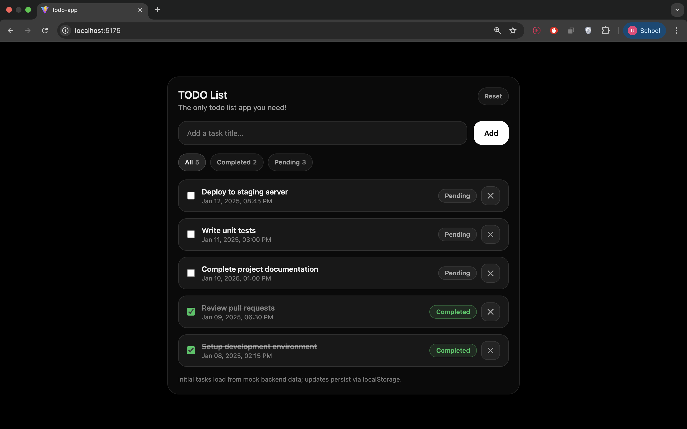
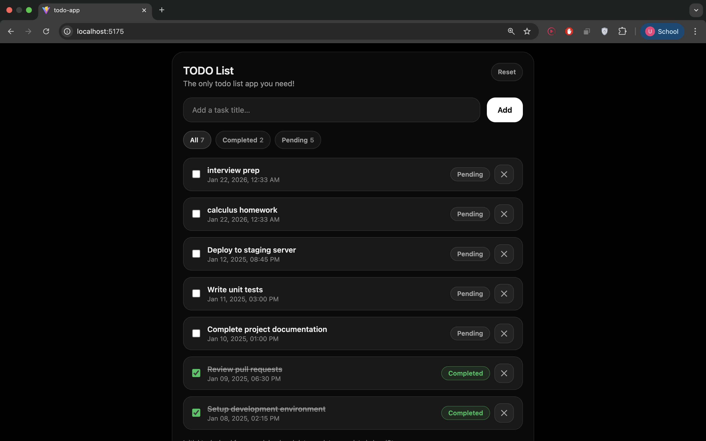
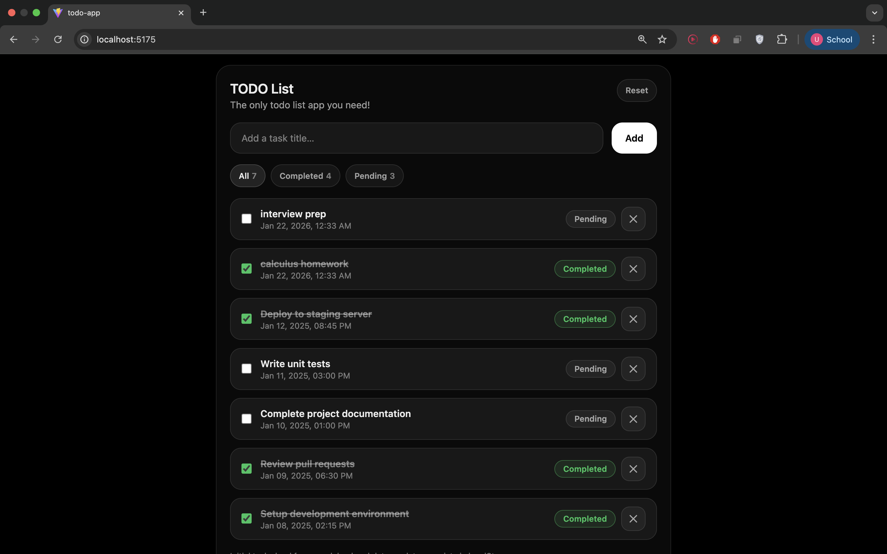
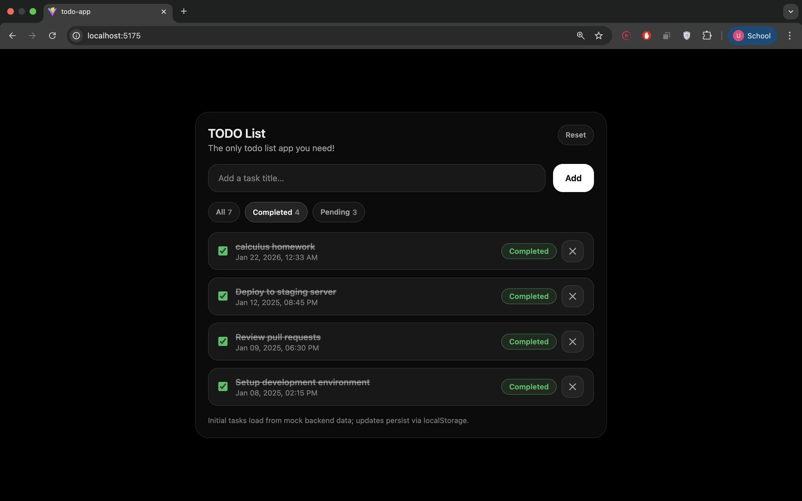

# Internship TODO List App! 

A lightweight TODO list app built with React that initializes from mock backend data and persists updates to `localStorage`.

## Features

- Load initial tasks from mock backend data on first run
- Persist tasks to `localStorage` so changes survive refresh
- Add new tasks with validation
- Toggle task completion
- Delete tasks with confirmation
- Filter tasks by All / Completed / Pending (with counts)
- Reset back to original mock tasks

## Images






## Tech Stack

- React
- Tailwind CSS

## Data & Persistence

- **First run:** seeds tasks from mock backend data and stores them in `localStorage`
- **Subsequent runs:** loads tasks from `localStorage`
- Any change to tasks (add/toggle/delete/reset) automatically updates `localStorage`

## Project Structure

- `src/App.jsx` — main application logic and UI
- `src/data/mockTasks.js` — mock backend task seed

## Getting Started

### Prerequisites
- Node.js (LTS recommended)
- npm

### Install
```bash
npm install
```

### Run locally 
```bash
npm run dev
```

